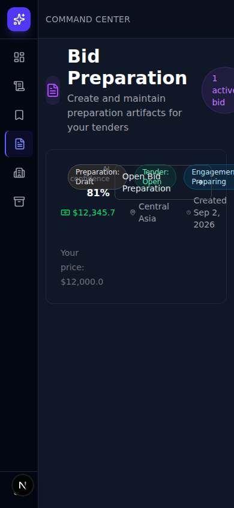
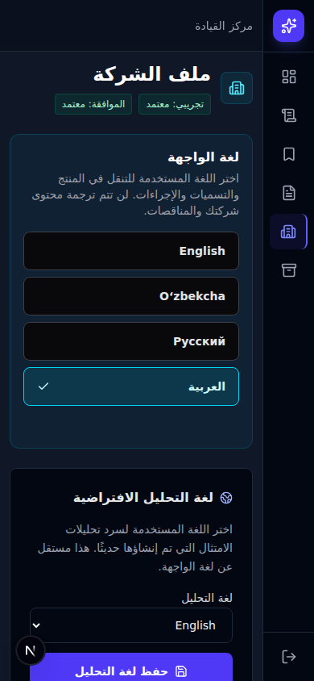

# Sprint 9.1 — Cross-Product Architecture, Legacy Surface and Release-Cleanup Contract

Audit date: 2026-09-05. Baseline: `b121cda5b76911c59fdab5733d70aa6883908e9c` (`main`).

## 1. Executive Summary

**Audit delivered; acceptance is NOT PASS and the application is not release-cleared.** This is an audit, not a cleanup implementation. Existing runtime, migration, dependency and test files were left unchanged. No production access, deployment, ADB recovery or EBRD recovery occurred.

The canonical domain separation is substantially present. Nevertheless, current source and fresh local probes contradict several assumed release invariants:

| ID | Severity | Finding and exact evidence | Planned owner |
|---|---|---|---|
| H01 | Critical | `backend/app/api/endpoints/auth.py:147` accepts self-asserted identity and issues a JWT. A synthetic existing pilot account received a token without Google proof or service authentication. | 9.3 auth |
| H02 | High | `tenders.py:4865` and `:5039` have no account dependency. Anonymous list returned 200; invalid bearer also returned 200; nonexistent detail returned 404 instead of 401. | 9.3 auth |
| H03 | High | Legacy Tender GETs perform live source HTTP; customer Tender Details and Compliance still call the legacy detail API. Document-preview fallback can invoke Playwright download. | 9.3 passivity |
| H04 | High | Explorer filesystem document filters scan the visible corpus before pagination (`tenders.py:2331`). Fixed query count does not bound rows or filesystem work. | 9.3 performance |
| H05 | High | Proposal upload reads the whole body, accepts extension alone, synchronously parses and calls the model (`proposals.py:750`). No route-level size cap. | 9.3 uploads |
| H06 | High | Google/Proposal/provider exceptions and Pydantic validation logging can expose internals/input excerpts; audit error returns `str(exc)` (`api/routers/audit.py`). | 9.3 error/logging |
| H07 | High | Tracked Compose contains literal administrative credentials and publishes PostgreSQL on all host interfaces. Values intentionally omitted here. | 9.3 configuration |
| H08 | High | Installed frontend lockfile audit reports 18 dependency advisories: 2 critical, 12 high, 3 moderate, 1 low. These are advisory matches, not demonstrated exploitation of every package. | 9.3 dependencies |
| H09 | Medium | Proposal list, Compliance history, Readiness records and Admin approval queue are unpaginated; history loads full version JSON plus document snapshots for metadata. | 9.3 performance |
| H10 | Medium | Middleware checks `/users/me` for each protected request; dev-browser full reloads additionally duplicate effects and session rotations. | 9.3 requests |
| H11 | Medium | Session-expiry interceptor targets absent `/login`; access-check network failures can send an approved user to pending approval. | 9.3 recovery |
| H12 | Medium | Mobile Bid Preparation badges overlap; My Tenders search and Explorer tabs can clip within the scroll container. | 9.4 verification; fixes in 9.3 |
| H13 | Medium | Ten stale static assertions, three import-time developer probes, 15 duplicate pytest basenames, platform-bound browser launchers, no CI. | 9.2 topology; 9.3 gate |

Fresh evidence: 19 frontend checks pass; clean Linux production build passes; backend diagnostic **602 passed, 10 failed, 1 skipped, 94 subtests passed**; connector gate **195 passed, 1 skipped, 4 subtests passed**; disposable PostgreSQL bootstrap/head/drift pass. Browser evidence is a separate 28-page representative matrix, not a claim that the historical 160-case Windows launcher passed unchanged.

## 2. Repository State

Initial working tree was clean. There were no uncommitted accepted-sprint changes to separate. Sprint 8.4 completion is a user-supplied premise; no separate S8.4 evidence document was present among the tracked docs.

| Item | Observed state |
|---|---|
| Git | `main`, SHA above; no commit/branch change made |
| Host Python | 3.12.3; existing backend venv did not contain FastAPI |
| Audit Python environment | Disposable `/tmp` venv; FastAPI 0.141.1, Celery 5.6.3, SQLAlchemy 2.0.52, Pydantic 2.14.0b1, Alembic 1.19.2, pytest 9.1.1, Playwright 1.62.0 |
| Backend dependency contract | `requirements.txt` mostly lower bounds; google-genai 0.3.0, pdf2image 1.17.0, python-docx 1.1.0, rarfile 4.1 pinned. No backend lockfile. Newly resolved audit versions are not asserted to be deployed versions. |
| Node/npm | Linux Node absent initially; isolated Node 22.14.0 / npm 10.9.2 used |
| Frontend | Next 16.1.6; React/react-dom 19.2.3; next-intl 4.14.2; next-auth resolves to 5.0.0-beta.30 despite manifest lower bound beta.25. All direct resolutions in bundle evidence. |
| Infrastructure | Compose: PostgreSQL 16, Redis 7 Alpine, pgAdmin, FastAPI, Next.js, general/AI worker, heavy worker, Beat |
| Local Docker | No daemon socket. No existing stack was started or rebuilt. |
| Database | Fresh PostgreSQL 16.15, isolated loopback port 56591; synthetic disposable database only |
| Configured existing DB head | **Not accessed / not verified.** Do not substitute the disposable head for this fact. |

A clean copy of tracked frontend files in `/tmp` was installed with `npm ci`. This resolved the original Windows node_modules' missing Linux native watcher/SWC binaries without altering package versions or the lockfile.

## 3. Canonical Product Architecture

Explorer `/dashboard/tenders` is the corpus browser; `/dashboard/tenders?view=recommended` is the canonical advisory view. `TenderRecommendation` is company-scoped advice. `TenderEngagement` is the customer pursuit record. My Tenders is engagement-backed. Bid Preparation owns Proposal artifacts. Tender Details composes local summary domains. Compliance uses an owned `TenderAnalysis` aggregate with immutable `AnalysisVersion` evidence snapshots. Readiness belongs to `CompanyProfile`; UI locale and analysis default belong to `User`. Source refresh uses the source registry, durable jobs and workers. Admin is a separate shell and guarded operator surface.

This is the intended and mostly implemented architecture. H01–H04 show why navigation correctness alone does not prove the complete runtime contract.

## 4. Frontend Route Inventory

All **29 page/route files** are individually listed in [inventory appendix](audits/s9_1_inventory.md#frontend-routes), including purpose, canonical/legacy classification, redirect, reachability and transitive API dependencies. Next's generated `/_not-found` also appears in the build; there is no `/login` page. Parent layout/middleware dependencies apply in addition to listed page dependencies.

Canonical customer pages: `/`, `/dashboard`, `/dashboard/tenders`, `/dashboard/tenders/[tenderId]`, its `/compliance` child, `/dashboard/my-tenders`, `/dashboard/bid-preparation`, its `[proposalId]` child, `/dashboard/readiness-vault`, `/dashboard/settings`, onboarding, pending-approval, access-blocked. Admin: `/admin`, `/admin/approvals`, `/admin/audit`, `/admin/companies/[companyProfileId]`.

Keep redirect compatibility for Hunter, workspace, bids, proposals and dashboard-admin aliases. `/dashboard/bids/[id]` validates Proposal ownership before client replacement; it is not a Tender-ID redirect. Infrastructure route handlers include auth, build, UI locale and two document download aliases.

## 5. Backend Endpoint Inventory

All **91 registered method/path entries** (including hidden Hunter slash alias and the doubled audit mount) are in the appendix and [runtime OpenAPI evidence](audits/s9_1_openapi.json). OpenAPI contains 83 paths. The runtime inventory follows FastAPI's included-router objects as well as direct routes; router-level guards were included in the review.

Canonical customer families: Explorer/recommendations, My Tenders/engagement, proposals, analysis/version/export, vault/company/preferences, source catalog/status/activity/refresh. Operator families: accounts, company approval, audit/corpus/reproducibility, source sync adapters. Investigate authenticated seed, scrape and proxy probes; authorization does not make them necessary release endpoints. Public metadata, health and login/logout are separately distinguished from the two unexpectedly unguarded Tender GETs.

## 6. Hunter Remnants

| Surface | Classification | Contract |
|---|---|---|
| `app/dashboard/hunter/page.tsx` | Required compatibility | Keep redirect to recommended Explorer until explicit bookmark policy changes. |
| `api/endpoints/hunter.py` + three payload classes | Legacy compatibility | No current customer frontend Hunter call found. External-client use unknown; do not infer safe deletion. Unbounded legacy feed. |
| `workers/hunter_tasks.py` | Active production despite old name | Beat schedules it every 30 minutes. It evaluates recommendations and dispatches UzEx document processing. Never delete merely for its name. |
| `core/agents/hunter.py` | Active recommendation generation | Worker caller remains. Rename only with task/import/Beat compatibility handled. |
| Hunter frontend components/hooks/client | No surviving standalone feed implementation found | Explorer uses `RecommendationSummary`, canonical recommendation commands. |
| Hunter tests/docs | Historical evidence or current redirect/boundary tests | Keep domain/redirect regressions; update the two stale foundation assertions listed below. |

## 7. My Bids / My Tenders Remnants

Customer navigation/catalogs use My Tenders and Bid Preparation. `/dashboard/bids` and `/dashboard/proposals` permanently redirect to Bid Preparation. The dynamic bids alias validates a Proposal ID and reports localized missing-artifact failure. `ProposalStatus` remains artifact state and must not be renamed into engagement state. Generic landing-page “workspace” copy is brand wording, not proof that the old workspace architecture is active. Old test/doc product labels are historical; preserve evidence and mark context.

## 8. Tender Workspace Remnants

`/dashboard/workspace` permanently redirects to Explorer. `components/workspace/DocumentViewer.tsx` is a **live Compliance dependency**, imported by the canonical Compliance page. Its directory name is cleanup debt, not dead code. No dedicated full-workspace ORM table or runtime feature gate was found. Keep the document viewer and its catalog. A later path rename must move the file and update its import plus localization/static references together.

## 9. Source Refresh Legacy Paths

`POST /tenders/refresh` is the UzEx compatibility request; source-specific `/sources/world-bank/sync`, `/sources/giz/sync`, `/sources/ebrd/sync`, `/sources/adb/sync` are operator adapters into `_request_source_refresh`. Canonical customer request is `/sources/{source_system}/refresh`. They do not directly execute connector retrieval inside the request.

The registry's runners still import `sync_*_tenders` from the large endpoint module. Those functions have runtime worker callers and source-specific result DTOs; they cannot be deleted with their HTTP adapters. GIZ targeted hydration and `/{tender_id}/sync-docs` belong to document work, not metadata source-refresh duplication. Retain both capabilities.

`source_refresh_jobs._bounded_int` and `_strict_bool` have zero repository uses beyond their definitions: low-risk deletion candidates. `_normalized_source_result` is test-only compatibility; migrate its tests to registry adaptation before removal. Endpoint-local old GIZ hydration helpers duplicate the active service; removal requires a closed call-graph set (9.2 contract).

## 10. Connector Registry Authority

`services/source_registry.py` owns source identity, label, visibility, refresh enablement, runner, strategy, document policy, limits and options. `tender_sources/keys.py` delegates identity validation to it. `SOURCE_REFRESH_SYSTEMS = frozenset(SOURCE_REGISTRY)` is a derived view, not another authority. Strategy/document-policy differences across the five sources are intentional.

Duplicate enumerations remain: `SourceFilter = Literal[...]` in `my_tenders.py`, frontend source type unions and source badge styling. The literals/unions need parity coverage; color classes are presentation, not capability ownership. Source-specific contact parsing and the worker's UzEx dispatch branch are real source behavior, not harmless label maps. No source is classified abandoned merely because retrieval is unavailable. Preserve ADB/EBRD recovery foundations.

Source label evidence is indexed by exact file/line in inventory JSON. Registry labels are canonical; frontend catalog payload labels are canonical data; source-specific EBRD access wording is explanatory brand copy; mocks and connector fixtures are data; historical docs are evidence. Do not replace institution names with UI translation keys.

## 11. Recommendation Boundary

`TenderRecommendation` is unique by Tender/company; Explorer reads it as a nullable advisory overlay. Dismiss/restore in `services/recommendations.py` enforce company ownership and do not create Proposal or engagement. Recommendation absence is not a negative pursuit decision. UI rationale is source/generated content and is not translated as product copy.

Boundary caveat: the Hunter sweep also enqueues UzEx document work and scans all active profiles/recent unscored tenders before its 25-item model batches. This is scheduled coupling and an unbounded worker input path, not a passive GET write. “Separate domains” is true for stored pursuit authority but not absolute orchestration independence.

## 12. Pursuit Boundary

`TenderEngagement` is the sole runtime pursuit-state authority. Statuses are `SAVED`, `EVALUATING`, `PREPARING`, `SUBMITTED`, `WON`, `LOST`, `DISMISSED`; transition/allowed-action helpers live in `services/tender_engagements.py`. User/company ownership and unique user/Tender identity are enforced. UI component state tracks pending operations/display filters, not a durable second pursuit store.

Explicit `prepare_bid` deliberately transitions saved/evaluating/dismissed intent to PREPARING and resolves the artifact transactionally. That is an authorized cross-domain command, not “Proposal exists implies pursuit.” Legacy Proposal status strings remain separate.

## 13. Proposal Boundary

`get_or_create_proposal_artifact` explicitly performs artifact-only resolution; `prepare_bid` owns the two-domain command. List/detail GETs join engagement summaries without creating rows. Proposal writes are user-scoped; no inspected Proposal customer action writes source-owned Tender fields. Private uploaded-TZ path/text is stored under Proposal structured data and a user/Proposal filesystem path.

Retain `/proposals` CRUD, prepare/continue, AI draft, upload, PDF and DOCX: they have current Bid Preparation callers. H05, H09 and export-header weaknesses are hardening tasks. User mirror company fields used for PDF/AI context are a separate stale-data risk: settings write `CompanyProfile`, while old Proposal context reads `User` company attributes. Reconcile authority without changing pricing.

## 14. Compliance / Analysis Boundary

`analysis_aggregates.py` uses a transaction advisory lock for one user/company/Tender scope. Historical duplicate parents remain separate; newest existing owned parent is selected and ambiguity logged. This is intentional compatibility, not a database-enforced unique parent tuple.

`analysis_versions.py` owns append-only version creation, snapshots, hash provenance, exact/latest/history reads and version numbering. Latest/detail/history/export resolve owned version state; no pre-version auto-backfill occurs on GET. Zero-version parents fail explicitly. Parent mirror JSON remains for compatibility and must not become read authority. `AnalysisVersion.analysis_language = NULL` stays “not recorded,” with `auto` direction.

Compliance requirements/evidence and the taxonomy matcher remain active. Arabic analysis selection is rejected while Arabic UI is enabled; Arabic PDF export remains explicitly gated. Old GIZ inline parsing helpers exist but the active asynchronous hydration service/worker must remain canonical. Main regressions include ownership, versioning, aggregate-concurrency and S8.2 language checks; they passed in the diagnostic apart from the separately listed unrelated stale UI assertions.

## 15. Locale Architecture

`User.ui_locale` → middleware persisted-locale header → `i18n/requestLocale.ts` / `request.ts` → server root `lang/dir` → next-intl is the canonical chain. Registry: `i18n/locales.ts`; backend validation: `core/locales.py`. The locale cookie is a lower-priority hint, not account authority. Accept-Language parsing is intentional anonymous/unset fallback. No active localStorage locale authority was found.

`messages.ts` loads the active locale; UZ/RU merge English fallback, AR loads its complete catalog without fallback. Four locale definitions across frontend/backend are semantic boundary duplication requiring parity tests. The root provider owns messages; customer pages do not fetch catalogs individually. Pseudo locale is development-only and explicitly opt-in. Admin uses shared Arabic shell plus an intentional LTR island.

## 16. Analysis-Language Architecture

Backend `core/analysis_languages.py` and frontend `i18n/analysisLanguages.ts` separate UI locale from analysis generation. EN/UZ/RU selectable; AR known/generation-capable but customer-gated. Prompt-language labels belong on the backend; frontend native labels/direction are a deliberate presentation contract. `analysis_language_content.py` localizes generated status narrative by analysis language, not UI locale. Backend/frontend selectable sets and historical NULL handling need permanent parity tests, not an attempted shared Python/TypeScript module.

## 17. Enum / Status Mapping

| Domain | Authority and presentation | Classification |
|---|---|---|
| Tender | `models/base.py`; `types/tender.ts`; `i18n/enumLabels.ts`; Explorer catalog | Keep enum/DTO parity; consolidate duplicate message mapping in 9.2 only after caller conversion. |
| Pursuit | `models/base.py`, engagement service; `types/engagement.ts`, workflow components | Canonical state; repeated labels/classes are presentation debt. |
| Recommendation | dismissal boolean/availability enum; RecommendationSummary | Independent from Tender/Proposal statuses. |
| Proposal | ProposalStatus; Bid Preparation list/detail presentation | Artifact-only; do not unify with pursuit. |
| Compliance | verdict enum, version status, safe hybrid extraction | Different enums express different facts; preserve UNKNOWN/NEEDS_REVIEW. |
| Readiness | `models/company.py`, `lib/readiness.ts` and catalogs | Backend validation + frontend labels are semantic duplication. |
| Refresh | job lifecycle, `sourceRefreshPolicy.ts`, source-refresh types | Preserve durable state and unknown never-refreshed state. |
| Documents | storage/download/parse states, `types/tender.ts`, document viewer | Availability differs from metadata presence; filesystem-dependent paths are costly. |
| Account | `core/access.py`, Admin capabilities, locale catalogs | Server capability authority; frontend role hints are not authorization. |

Unknown enums must render unknown, never silently OPEN, compliant or approved. `useHybridCompliance.ts` is a plain payload-validation helper despite its filename; it is not a React hook. Its optional count defaults are compatibility display behavior, not proof of successful analysis.

## 18. Error Contracts

Current contracts mix `detail` English strings, stable-code strings, structured validation arrays, source-safe status/message DTOs and localized frontend fallbacks. `i18n/errors.ts` recognizes only locale error codes; analysis/preferences contain additional codes. Various pages inspect `response.data.detail`, so arbitrary text remains part of the effective client contract.

H06: audit authorization exception exposes raw exception copy. Model/parser logs can contain validation input representations; provider exceptions may contain request metadata. `documentProxy.safeErrorDetail` masks 5xx but forwards other bodies. In 9.3 establish `code` + safe message/details, preserve HTTP status, and map existing clients deliberately. Do not change all error semantics during deletion work.

## 19. Auth / Authorization

[Dependency inventory](audits/s9_1_inventory.json) records endpoint guards and runtime OpenAPI includes transitive dependencies. Runtime Python resolves `core/security/__init__.py`; `core/security.py` is a shadowed mirror. The resolver validates JWT, account disabled/rejected state, integer auth_version and exact version equality. Wrapper dependencies are compatibility names, not bypasses by themselves.

Approved customer: pilot/account/company guard. Pending user: own profile, onboarding and preferences use current-user access. Refresh/catalog/activity require approved user (company gate intentionally differs). Admin account writes require admin; selected Admin reads allow operators. Proposal and engagement routers add pilot guards even where endpoint signature says `get_current_user`.

**Disabled-account audit cannot pass globally:** two legacy Tender reads are unauthenticated. The Google bridge has the independent H01 trust failure. The other tested canonical customer/operator paths reject unauthenticated requests and the existing disabled/auth_version suites pass. Frontend middleware cannot be accepted as sole backend authorization.

## 20. Passive Read Audit

| Read dependency graph | Result |
|---|---|
| Explorer → `list_explorer_tenders` → SQL joins/count/page → batched local summaries | No generated domain writes in measured reads; H04 unbounded filesystem filter prepass. |
| Tender Details page → **both** `GET /tenders/{id}` and `/details` | `/details` is local; page as a whole inherits legacy I/O. |
| `get_tender` → `_apply_live_uzex_dates` → `_uzex_trade_list_date_map` | Source HTTP on GET. Response-only dates do not dirty ORM but still violate no-source-I/O. |
| `get_tender` → missing contact override → WB/ADB/GIZ fetch or UzEx HTTP | Conditional source retrieval; not fixed by bounded SQL. |
| Legacy list / decision snapshot → `_apply_live_uzex_dates` | Same live-source read dependency. |
| Compliance page → legacy Tender detail + documents + compiled text + latest version | Version reads passive; legacy detail remains non-passive. |
| DocumentViewer/preview → document proxy → `download_document` → missing-storage UzEx scraper | Conditional external document retrieval from GET; no stored-path fallback when a file is lost. |
| My Tenders / Proposal list/detail / Readiness / version history / source status/activity | No INSERT/UPDATE/DELETE in all 30 measured reads. |

This audit did not execute external source fallbacks. Their call graphs are source evidence. Browser fixtures cannot prove absence of real backend source I/O. Browser loads produced no product-generation commands, but did rotate auth sessions; security-session work is distinguished from domain generation.

## 21. Write Authority Matrix

| Domain | Canonical authority | Alternative paths / classification |
|---|---|---|
| Tender source fields | `tender_sources/base.persist_tender_batch`, registry runners | `upsert_tender` delegates real AsyncSession to batch; fake-session branch is test compatibility. Connector close/quarantine/ADB normalization are source-owned writes. |
| Tender derived document text/coverage | heavy document worker, GIZ hydration service | Endpoint-local duplicate GIZ chain is legacy candidate; document coverage metadata is an explicit derived exception to source field ownership. |
| Recommendation | scheduled Hunter evaluation; owned dismiss/restore service | Unique pair prevents duplicate records, but repeated delivery can redo model work and lose transaction progress. |
| TenderEngagement | `tender_engagements.py` + explicit Bid Preparation command | Migration reconciliation/tests only outside runtime service; no Proposal-state authority. |
| Proposal | artifact resolver and owned Proposal commands | User-scoped upload/export context; legacy generic create remains artifact-only. |
| AnalysisVersion | `analysis_versions.py` under aggregate ownership/locking | Historical migrations/backfill are immutable evidence; do not remove or mutate version tables. |
| SourceRefreshJob | `_request_source_refresh`, job lifecycle service, leased worker | Compatibility HTTP adapters delegate; status/activity are reads. |
| User preferences | `users.py:update_current_user_preferences` | Locale cookie/action is presentation hint. Preference change does not revoke session. |
| Admin account state | account lifecycle/survivability services, audited admin/CLI paths | Google allowlist reconciliation is another privileged write path; H01 makes it a hardening priority. |

Every assignment/constructor/SQL-call candidate is indexed in `write_candidates`; assignments there include response DTOs and must not be mistaken for ORM writes.

## 22. ORM / Schema / Service Inventory

The appendix enumerates **25 ORM models**, **148 schema/type declarations**, and **33 service modules**. Same-module schema references matter: e.g. CertificationUpdate, LicenseUpdate and FinancialHistoryUpdate are used by CompanyVaultUpdate and are not dead. SourceSync/Refresh/Adb response DTOs remain internal runner contracts. CanonicalDocument is a source descriptor dataclass, not an ORM table.

`ProjectResponse` is a test-only historical/API-ready DTO, referenced by `test_s1_2_world_bank_project_enrichment.py`; preserve its enrichment semantics until tests are transferred to the live ProjectContext contract. All ten component files and all service modules have static runtime references; no whole service or table is approved for deletion on a zero-caller claim. Low-level zero-caller helper candidates are listed explicitly in section 40. Models divide into canonical domains (Tender, engagement, Proposal, recommendation, owned analysis/version, company/user, refresh) and support (project/link/roles, sync/document, taxonomy/credentials/requirements/overrides, audit). No unused table was established.

Tender writes: batch/upsert, connector status reconciliation/quarantine, source metadata enrichment, derived document text/coverage, synthetic seed endpoint/scripts. No Proposal/engagement/Recommendation action was found rewriting Tender title, budget, deadline or discovery time. `created_at` is server-default first durable discovery; source updates exclude it. No `first_seen_at` field exists. Newness is derived by `core/tender_newness.py` / frontend helper from the 24-hour contract.

## 23. Frontend Component / Hook Inventory

Static graph resolves `@/`, relative imports, directory indexes and dynamic literal imports, rooted at Next entrypoints and middleware/auth. All ten component modules are reachable. Three named React hooks: `useSourceRefresh`, `useGeographyMeta`, `useServiceMeta`. No old Hunter hook remains. Geography/service hooks perform independent per-mount requests without shared cache; dev replay doubles them. `useHybridCompliance.ts` exports `extractHybridCompliance`, a live validator, so filename-based dead-hook detection would be wrong.

No automatic dead-code verdict is based solely on comments, single use, grep absence or a missing external import. Framework discovery, in-module calls, Celery registered names and external clients all require review.

## 24. Feature Flags / Environment

The full variable-name/reference inventory, configured-file **names only**, shell/Compose inputs and production classifications are in the appendix. No secret values were copied into evidence. Required secrets: DB credentials, backend signing secret, Google OAuth credentials, frontend auth secret; Gemini key is required for generation, not passive reads. Telegram token belongs to the uncomposed bot, not the customer app.

| Flag/group | Owner; default | Production meaning / disposition |
|---|---|---|
| AUTO_CREATE_TABLES | backend config; false | Dangerous schema bypass if enabled; keep dev escape hatch, enforce off in release gate. |
| PLASMA_ENABLE_PSEUDO_LOCALE | next-intl; opt-in `1`, nonproduction only | Keep test-only; production always disabled. |
| Source refresh_enabled / customer_visible / operator_visible | registry; true for current definitions | Keep registry authority; availability problems do not mean dead connectors. |
| Arabic customer analysis / PDF gate | language registry false / explicit export rejection | Keep, no workaround or ungating. |
| SOURCE_REFRESH_COOLDOWN_SECONDS | request layer; 300 | Keep abuse bound. |
| SOURCE_REFRESH_LEASE_SECONDS / HEARTBEAT_SECONDS / QUEUED_REPUBLISH_SECONDS | jobs; 180 / 30 / 60 | Keep worker recovery; heartbeat bounded relative to lease. |
| WB autodrain batch / interval / retry backoff | enrichment; 25 / >=60 / 900 seconds | Keep, scheduler is enrichment not source refresh. |
| TENDER_OCR_DISABLED / DEMO_OCR_BYPASS | parser; off | Dev/demo bypass affects document truth; forbid demo bypass in release profile. |
| OCR page timeout / pages / DPI / skip chars | parser; 12 / 2 / 150 / 5000 | Keep bounded resource controls. |
| GEMINI_REQUIREMENT payload / overlap / concurrency | extractor; 120000 / 1000 / 3 | Keep bounded model work; model identifiers are configuration, not feature flags. |
| GIZ archive compressed / expanded / individual / files / nesting | connector; 100 MiB / 250 MiB / 50 MiB / 200 / 1 | Keep security bounds. |
| TENDER_DOCUMENTS_ROOT | workers/storage | Keep; reconcile all worker mounts. |
| PLASMA_ADMIN_EMAILS / OPERATOR_EMAILS | access/bootstrap | Privileged configuration; protect bridge before relying on allowlists. |
| NEXT_PUBLIC_API_URL / FRONTEND_NEXT_PUBLIC_API_URL | old client/build contract | Axios uses literal `/api/v1`; shell/Compose still forward values. Candidate retirement only after build-contract proof. |
| ACCESS_TOKEN_EXPIRE_MINUTES in configured .env | no settings reader | Stale: runtime security constant is eight hours. Remove misleading variable in 9.2 without changing expiry. |

## 25. Logging / Secrets

No production logs or customer documents were read. This is a source logging-sink/configuration audit. Source logging is generally structured around IDs, stages, counters and timings. Exceptions: config/lifespan `print`, Proposal upload path printing, Google file handles, raw provider exceptions, Pydantic validation exceptions, frontend `console.error(error)` objects. Axios errors can carry request config/Authorization into a browser console. No claim is made that every exception currently contains a secret; these are unsanitized sinks.

`docker-compose.yml` contains a committed pgAdmin password and a fallback DB password. Review/rotate any reused credentials via their owner in 9.3; this sprint neither prints nor rotates them. `pgadmin/servers.json` and setup artifacts should be reviewed as configuration, never used to discover or access production.

Observability: release health endpoints, admin corpus/reproducibility, refresh counts/stage/elapsed fields, document structured logs, analysis duration, WB backlog reports, worker release identity exist. Release-critical gaps: DB startup failure is logged while app continues; no checked-in readiness dependency probe/alert contract, no enforced failure-rate or queue-age alert, no correlation/redaction standard. Do not build an unrelated observability platform.

## 26. Celery / Beat

Seven task definitions are enumerated in the appendix. Routes: source refresh and WB enrichment/dispatcher → `celery`; Hunter sweep → `ai_fast_queue`; document processing, GIZ hydration, ADB document enrichment → `heavy_dl_queue`. Compose general worker consumes `celery,ai_fast_queue`, heavy worker consumes only `heavy_dl_queue` at concurrency 1, max ten tasks/child. These mappings are aligned.

Beat has exactly two entries: Hunter every 30 minutes and WB backlog autodrain at configured interval. No automatic source-refresh Beat schedule was found. Hunter's document dispatch is hidden scheduled document work and must be preserved or deliberately separated, not accidentally deleted.

Idempotency: refresh claim/lease/owner guards, heartbeats and retry/republication state; WB lease/TTL/backoff/autodrain; document job identities/partial active uniqueness and content hashes. Tasks are late-acked/reject-on-worker-loss, so duplicates must be expected. Hunter loads full inputs and performs model work before one commit; per-run `dispatched_docs` is not cross-process deduplication. No standalone notification-delivery Celery task exists; refresh notices are UI activity consumption. Analysis is request-driven, not a background task. Heavy/general services' filesystem mounts need verification before enabling new general-worker document writes.

## 27. API Performance

[Measured SQL evidence](audits/s9_1_query_measurements.json) includes real JWT/account dependencies and actual PostgreSQL, with parameters omitted. Two profiles have 1 and 30 rows; shared corpus grows from 1 to 31. These are deterministic functional fixtures, not production p95 benchmarks. Source jobs and pending approval rows were empty; their large-cardinality performance is not measured here.

| HTTP family | Queries at 1 / 30 | Result / remaining bound |
|---|---:|---|
| Explorer | 7 / 7 | Page cap 100; filters/counts before page; source-document special filters have global prepass. |
| Explorer documents_available | 8 / 8 | Constant SQL count, unbounded row/filesystem input. |
| Tender `/details` | 13 / 13 | Local and tenant-scoped; does not cover companion legacy detail source I/O. |
| My Tenders | 6 / 6 | SQL pagination, joined summaries. |
| Proposal list | 4 / 4 | Returns 1 / 30; no pagination. |
| Compliance latest/history/detail | 7 / 7 each | History returns 1 / 30 versions and eagerly reads snapshots; aggregate ambiguity reads all matching parents. |
| Vault / Readiness | 6 / 6; 4 / 4 | Eager children prevent N+1; nested arrays and record list unbounded. |
| Source status/activity/catalog | 2 / 2; 2 / 2; 1 / 1 | Includes auth; catalog service itself zero SQL. Activity uses cursor + limit+1. |
| Admin accounts/approval queue | 4 / 4; 2 / 2 | Accounts paginated; approval queue unbounded, empty in measurement. |

All 30 measured responses returned 200 and issued zero INSERT/UPDATE/DELETE. No N+1 emerged in these fixtures; this is **not** “all queries bounded.” Explorer counts/new_only/recommended/dismissed have unchanged passing S6/SR regression coverage. SQL evidence supports evaluating an analysis-owner/tender/order index and bounded history projections; no index is declared a proven production speedup without representative EXPLAIN/row-volume evidence. No speculative index or migration was added.

## 28. Frontend Request / Bundle

Root: server next-intl provider + client SessionProvider; dashboard conditionally adds SourceRefreshProvider after access approval. Admin has its separate guard/shell. Shared provider survives dashboard navigation but full reload and dashboard/Admin boundaries remount it. Locale route refresh must preserve source cursor/session state.

Fresh 390px dev-browser instrumentation records every mock-backend request, including middleware-originated requests. EN full-load counts: Explorer 7 `/users/me`; Tender Details 11; Compliance 19; Settings 17. Most page data effects execute twice in dev; access-status three times and auth refresh four times appear in these fixtures. Catalog/status remain one each per load. **Do not treat dev Strict Mode counts as production counts.** Middleware's per-protected-request `/users/me` dependency is nevertheless real source-level amplification. 9.3 must measure production navigation and preserve immediate revocation when reducing repeated checks.

Clean production build: 36 JS chunks, 1,219,227 raw bytes; sum of individually gzipped chunks 371,079 bytes, across all routes (not first-load size). [Bundle evidence](audits/s9_1_bundle.json) records resolved direct versions and largest chunks. Active Framer Motion is used by Bid Preparation; Axios/clsx/icons/next-intl remain used. `jwt-decode` and `tailwind-merge` have zero tracked code imports and are low-risk dependency deletion candidates after lock/build checks. No chart/editor package or standalone Hunter client implementation remains. Locale loader is server-side; no client import graph edge loads every locale's JSON.

Next warnings: middleware convention deprecated, nonblocking now but a migration task. All routes dynamically render, expected for account/locale isolation. Original native-module build failure is platform/environment debt; clean Linux build passes. Backend warnings: two Hunter class-config deprecations, Alembic missing `path_separator`, PyMuPDF `fitz` warning and SWIG deprecation warnings. The exact newly resolved dependency set, including a Pydantic prerelease, reinforces the lock/reproducibility gap.

## 29. Test Topology

Inventory: 136 tracked test/probe files, 15 duplicated Python basenames, 25 npm scripts; no CI file. Root backend diagnostic excludes three unsafe/non-test import-time probes explicitly; it does not count them as passing coverage.

`backend/test_ai.py` changes to `d:\projects\plasmaos\backend` at import, loads a developer .env/PDF and calls a model, printing output. It is a developer probe, not a test. `test_tender_api.py` calls a live local API at import; `test_uzbek_nlp.py` downloads OpenAPI at import. Initial diagnostic confirmed collection errors for the latter two. A selected duplicate-basename collection reproduced pytest import mismatch. Exclusions are temporary audit invocation choices, not modifications to the suite.

Exactly ten current stale failures:

| Test node (module :: class/function) | Old expectation | Current architecture / 9.2 action |
|---|---|---|
| test_p0_3a_onboarding_access :: OnboardingFrontendTests.test_pending_and_session_refresh_ux_is_present | Literal “Company profile submitted” in page source | next-intl catalog + onboarding submit state; UPDATE semantic/catalog assertion. |
| test_s1_admin_approval_queue :: AdminApprovalQueueTests.test_admin_pages_and_pilot_route_block_exist | “Admin Console” in legacy page | Dashboard-admin page redirects to standalone Admin; UPDATE redirect + real layout test. |
| test_s2_1_readiness_vault :: S21ReadinessVaultTests.test_frontend_pages_exist_for_profile_and_readiness_vault | Literal “Company profile” in page | localized settings/readiness; UPDATE. |
| test_s2_2_geography :: S22GeographyTests.test_frontend_uses_shared_geography_options | “Select all Central Asia” in source | taxonomy localization and shared metadata; UPDATE. |
| test_s2_3_services :: S23ServiceTests.test_frontend_uses_shared_service_metadata | `service.label` | canonical service value with localized taxonomy label; UPDATE. |
| test_s2_4_readiness_admin :: S24ReadinessAdminTests.test_company_settings_shows_status_and_clean_target_summary | Literal “Approval:” | catalog interpolation; UPDATE. |
| test_s2_4_readiness_admin :: S24ReadinessAdminTests.test_readiness_vault_ux_supports_labels_filters_and_optional_files | `labelForDocumentType` | current localized readiness labels; UPDATE preserving filters/optional-file behavior. |
| test_s3_1_tender_explorer_filters :: S31TenderExplorerFilterStaticTests.test_frontend_uses_s2_taxonomies_for_tender_filters | Literal “Central Asia” | API-backed geography + translated presentation; UPDATE. |
| test_s6_1_hunter_explorer_convergence_foundation :: test_explorer_and_hunter_current_routes_are_distinct_and_tender_canonical | Exact `listExplorer({` text | same client with reformatted invocation and canonical redirect; UPDATE structural/behavior assertion. |
| test_s6_1_hunter_explorer_convergence_foundation :: test_s6_4_frontend_converges_with_passive_route_retirement | Literal tuple `'recommended', 'Recommended'` | translated tab label; UPDATE. |

Do not delete those behaviors or mute the failures wholesale. Keep domain tests across sprints where they cover distinct invariants. Same basename does not establish duplicate coverage: root contracts and PostgreSQL proof scripts serve different purposes.

## 30. Path / Platform Debt

Windows drive paths, fixed WSL host IP, pinned Chrome executable versions and `cmd.exe`/PowerShell launchers occur in historical browser/probe tooling. The maintained source resolver `core/storage_paths.py` centralizes persisted Windows/WSL conversion; it does **not** confine paths to a tenant root and should not be advertised as a security sanitizer.

`frontend/README.md` remains generic create-next-app instructions. Python/npm browser scripts assume `python` and Windows launch infrastructure; no documented clean Linux setup exists. Audit used a fresh Linux checkout and synthetic browser harness, not silent edits to historical acceptance assertions. Permanent browser setup belongs to 9.2 topology/9.3 gate. Do not rewrite historical migration paths or delete needed document compatibility.

The repository also tracks **53 `__pycache__` files**, despite ignore rules. Their interpreter/platform-specific bytes are neither source nor release evidence. In 9.2 remove them from Git tracking, retain ignore rules, and prove a clean import/test run does not dirty the tree. This is separate from the three cache modifications observed after the session restart.

## 31. Alembic / Schema Drift

Repository has 30 migration files and one head, `20260904_0001_s8_2_analysis_language`; parent graph resolves. Fresh bootstrap → current head succeeds; disposable `alembic current` matches; `alembic check` reports no new upgrade operations. The repository schema-preflight script was invoked against the same empty disposable database with `/dev/null` env fallback. Its completion/output was not captured before the environment restarted; **schema-preflight completion is unverified**. The independently observed Alembic check did pass. Neither result certifies production data quality.

Caveat: `alembic/env.py:_ensure_alembic_version_column_width` runs DO/ALTER and commits even for online current/check commands. These commands are not strictly passive on an arbitrary target; audit ran them only on the disposable DB. Record configured DB head separately as unverified. Preserve baseline snapshot and all migrations; never squash “obsolete” sprint history.

Uniqueness: Tender canonical/source identity, Recommendation pair, engagement user/Tender, Proposal user/Tender, version analysis/number + predecessor, active source-refresh partial index are present. Document descriptors deduplicate in application code but TenderDocument has no matching durable document-identity uniqueness constraint; concurrent descriptor delivery requires targeted proof. Parent analysis uniqueness is advisory-lock/newest-history policy, not a missing constraint to add blindly.

## 32. Tenant Isolation

Engagement, Proposal, analysis/version, readiness/company and preferences use stable user/company IDs; company names are display snapshots. Canonical reads/actions do not gain another tenant's private analysis merely because the actor is admin. Existing ownership/account/concurrency tests passed. Admin diagnostic endpoints deliberately permit privileged corpus/audit inspection; ordinary customer pages do not inherit those permissions.

Shared Tender/project/document/source activity is separate from tenant-owned advice, engagement, Proposal, Compliance and readiness. Schema enforces one CompanyProfile per User; conceptual “same company” in fixtures must not be interpreted as general multi-user collaboration support. Source activity is shared safe event data, not a tenant job-history endpoint.

Cascades: deleting User cascades owned Proposal/profile children, but analysis ownership uses RESTRICT; deleting Tender can cascade documents/private artifacts/analysis history; audit actor references use SET NULL or historical snapshots. No inspected account cascade deletes shared Tender corpus. Hard-delete tooling is hazardous because it can destroy dependent history; retain account disable/restore and protect immutable audit/version records. No destructive operation was performed.

## 33. OpenAPI / Compatibility

OpenAPI coverage includes compatibility routes, admin probes and legacy schemas; hidden `/hunter/` must be inventoried outside OpenAPI. `/audit/authorize` and `/api/v1/audit/authorize` mount the same handler. No duplicate exact method/path was found in the 91 entries; duplicated semantics and auth omissions are separate findings.

API response styles: UUIDs vs manual strings, list-only vs envelope, `created_count` vs old `new_count`, canonical statuses vs legacy lowercase/string messages. Offset/limit is intentional for Explorer/My Tenders/Admin; cursor is justified for ordered refresh events. Bare Proposal/version/readiness lists are compatibility contracts requiring explicit pagination migration. ORM timestamps reviewed use timezone-aware columns; manual Proposal export `datetime.now()` is host-local presentation, and input/filter date parsing permits naive timestamps without a universal UTC normalization boundary.

External-client usage cannot be proven by repository imports. Zero current frontend callers authorizes investigation, not removal. Each endpoint deletion must explicitly choose keep adapter, mark deprecated + removal window, or an approved breaking change. Include scripts, worker imports, stored links and named tasks in the proof.

## 34. Localization Dead Keys

The artifact flattens all **866 English catalog keys**, classifies literal reference candidates versus dynamic/unreferenced candidates, and preserves namespaces. Non-English shape/ICU and RTL gates passed. Dynamic patterns (`t(action)`, interpolated enums, namespace translators, nav key arrays) prevent regex-only deletion proof. No translation key is unconditionally approved for deletion from this scan.

Customer nav uses canonical product labels in EN/UZ/RU/AR. Old Hunter/My Bids terms occur primarily in historical routes/tests/docs; DocumentViewer “workspace” namespace/path is live. Arabic UI is selectable; analysis AR is excluded in all selectors; PDF gate remains. A 9.2 key deletion needs namespace-aware callsite proof plus all-locale shape/ICU tests, not merely no literal string match.

## 35. Security / Upload / Export

Session: backend cookie HttpOnly/Secure/SameSite=Lax; frontend JWT session through Auth.js; locale cookie deliberately readable and not an authorization secret. Auth.js handles its own auth-action CSRF, but backend cookie fallback and application state-changing APIs have no general explicit CSRF/origin contract. Do not infer a demonstrated cross-site exploit from this alone. H01 is independently proven. `trustHost: true` and proxy origin ownership need deployment review.

CORS default explicitly lists localhost, old server HTTP origins and the marketing HTTPS origin; credentials are enabled, methods/headers `*`. There is **no credentials+origin-wildcard default**, but console origin alignment is stale. Effective production override and reverse-proxy security headers are not verified. Next config sets no application CSP/HSTS/frame/nosniff headers. Add an intentional header/preview embedding contract in 9.3.

Validation: UUID path inputs, bounded Explorer search/limit, refresh cursor max 512, registry source/options, locale/language enums, Admin IDs/reasons are present. Google identity strings are not identity verification. Upload filename ownership path is safe from supplied-name path traversal, but full-body read/extension-only validation and synchronous model work need limits, signature check, cleanup and explicit failure state. Readiness “file” fields are metadata, not a separate multipart upload endpoint.

Exports: Compliance PDF resolves owned version and Arabic gate; Proposal PDF/DOCX resolve owned artifacts but build Content-Disposition from source external ID/date without shared robust sanitization. Document `_safe_content_disposition` handles Unicode encoding but does not strip ASCII CR/LF/quotes; review all source-derived names. Stored downloads read full file bytes into memory, while frontend proxy streams backend body. Admin proxy-download/test-scrape URL inputs need source allowlisting/SSRF review; no external target was probed.

Abuse controls: refresh cooldown, active-job uniqueness, leases, source option bounds, OCR/archive limits, model chunk bounds/cache exist. No general route-level login/analysis/upload rate limit was found. Bound these operations without introducing an unrelated enterprise limiter.

## 36. Failure Recovery

Source refresh has terminal-safe messages, activity cursor and recoverable notices. Analysis failures preserve requested language and older versions in history. Missing documents have explicit sync/unavailable messaging. Proposal upload parsing failure can continue into model work; model failures and incomplete writes need deliberate rollback/temp-file cleanup. Recommendation feed generation is scheduled with logger-only failure and no separate customer job status.

H11 needs a canonical sign-in redirect and distinction between transient access-status failure and true pending approval. Loading/error treatment varies: localized inline alerts and role=status coexist with console-only failures and generic spinners. Preserve state on failed saves and let users retry. Representative mobile screenshots show current page-load states only; no end-to-end successful purchase/submission/generation flow was invented.

Representative mobile capture, 390×844, in all four UI locales (28 pages):

1. Explorer — readable filter stack; tab row clips/scrolls horizontally; verify discoverability and keyboard access.
2. Tender Details — readable stacked summary and mixed-script content; lower sections require the inner main scroll.
3. My Tenders — status chips wrap; long RU search controls clip in narrow space.
4. Bid Preparation — overlapping status badges and narrow card/header text; medium release-quality debt.
5. Compliance — analysis content remains LTR where intended; narrow viewer needs scrolling; Arabic selection absent.
6. Readiness — filters stack; table requires horizontal navigation, which needs accessible cues/keyboard checks.
7. Settings — locale/analysis choices remain distinct and readable; no automatic Arabic analysis availability.

All observed pages had correct root lang/dir and no page exceptions. DOM label checks found no unnamed input/select/textarea in these captured states, but focus traps, contrast and screen-reader behavior were not established by screenshots. [Capture matrix](audits/s9_1_browser/results.json) and images are evidence, not final 9.4 accessibility certification.

## 37. Documentation / Scripts

The appendix individually lists all 42 tracked documentation/readme files and 47 existing scripts. Sprint documents are historical evidence for their SHA/time; their old migration heads and product labels must not be read as current setup authority. No root setup README was found; frontend README is stock scaffolding. Preserve baseline/bootstrap/migration proof resources and connector gate. Mark one-off diagnostics, schema-altering add_* scripts, reset/init/seed and probes as historical/operator-dangerous rather than recommended setup.

`compose-release.sh` derives build identity and forwards Compose arguments; it is an operational wrapper, not a test gate. No deploy command was executed. Backend runner requirements omit explicit test dependency locking. Worker queues, storage mounts, Redis, migrations, locale/gates and OAuth bridge trust must be documented in a future canonical setup guide. ADB/EBRD audit docs remain context for later recovery.

## 38. CI / Permanent Release Gate

No tracked CI configuration exists. Passing dozens of manual sprint scripts is not enforced regression prevention. Proposed compact gate (9.3 implementation):

| Gate | Required coverage / scope |
|---|---|
| Backend core | Clean collection; engagement/Proposal/Readiness/domain reads and write boundaries. |
| Security/auth | Real ASGI auth matrix including direct backend paths, Google bridge proof, disabled/rejected/version invalidation, Admin/tenant isolation. |
| Analysis/versioning | ownership, advisory concurrency, append-only/history/export, language independence, Arabic gates. |
| Connectors/workers | Existing connector gate offline fixtures, source registry parity, refresh lease/duplicate delivery, heavy queue/Beat configuration. |
| Migration drift | Fresh baseline bootstrap → sole current head, disposable upgrade/downgrade matrix, autogenerate check; forbid production targets. |
| Frontend | npm ci, typecheck, lint, production build, locale/RTL/static contract checks. |
| Browser smoke | Portable Chromium EN/UZ/RU/AR canonical routes, auth recovery, mobile/RTL, request/passivity instrumentation using controlled fixtures. |
| Dependencies/config | Locked reproducible environments, reviewed advisories, no known literal credentials/demo bypass, safe CORS/headers/cookies profile. |

Do not permanently exclude known failing behaviors. First repair topology/stale expectations, then define small maintained domain suites and retain migration evidence separately. Browser request measurements must include server-originated middleware traffic and distinguish development replay from production behavior.

## 39. Cleanup Risk Matrix

| Candidate | Risk | Reason |
|---|---|---|
| Two unused refresh validators | LOW | No callers, no data effect. |
| jwt-decode / tailwind-merge direct dependencies | LOW | No imports; lock/build/transitive check still required. |
| Import-time probes rename/guard | LOW | Not runtime/product coverage; protects collection. |
| Ten stale assertions + duplicate proof basenames | MEDIUM | Preserve behavioral coverage and imported helper dependencies. |
| Shadow `core/security.py` | HIGH | Security-sensitive, direct-file test/external loader compatibility possible. |
| Endpoint-local duplicate GIZ helper closure | MEDIUM | Active worker service must remain; test helpers and nested call edges matter. |
| Hunter HTTP routes / audit alias / sync adapters | HIGH | External callers unknown; guard/capability differences; keep until decision. |
| Hunter named Celery worker | HIGH | Scheduled production work; queued task-name compatibility. |
| DocumentViewer folder rename | MEDIUM | Live Compliance import/catalog/tests. |
| Source DTO/model/migration deletion | HIGH | Runtime runners or durable data; no approved deletion. |
| Translation candidate keys | MEDIUM | Dynamic use makes false positives likely. |
| Stale environment/build args | MEDIUM | Deployment scripts may still consume names despite dead client setting. |
| Historical docs/script cleanup | LOW/MEDIUM | Preserve accepted evidence and migration harness dependencies. |

Risk combines callers, external compatibility, data/migration impact and coverage. “Low” is not authorization to edit runtime during 9.1.

## 40. Sprint 9.2 Contract

Ordered cleanup only; do not mix H01–H12 runtime hardening into this contract:

| Order / target | Why legacy / unused proof required | Dependencies and tests | Rollback risk |
|---|---|---|---|
| 1. `backend/test_ai.py` → `backend/scripts/probes/ai_probe.py`; analogous moves for test_tender_api/test_uzbek_nlp | Top-level live I/O, no pytest test functions. Add explicit main, configurable fixture path and explicit invocation. | Update references; collect-only must never call API/model or chdir. | LOW; preserve developer ability, no product coverage lost. |
| 2. Rename 15 colliding `backend/scripts/test_*.py` proof files to `verify_*.py` or scoped domain package names | Collision reproduced; not duplicate behavior. | Update every `from scripts...` reference, especially root PostgreSQL bridge test, then run proof matrices and broad collect. Full mapping in appendix. | MEDIUM; revert names/imports together. |
| 3. Update exactly ten nodes in section 29 | Old literal/source-shape expectations against current locale/Explorer/Admin contracts. | Replace with semantic/catalog/route assertions; rerun full root maintained suite. Do not deselect failures. | MEDIUM; verify equivalent behavior before deletion of any redundant node. |
| 4. Remove `source_refresh_jobs.py:_bounded_int`, `_strict_bool` | Repository search finds definitions only; registry validates options. | SR2/SR3, invalid-option and connector gate. | LOW; no DB changes. |
| 5. Retire `tenders.py:_normalized_source_result` and its obsolete adapter-only tests | Only `test_p0_3b_source_refresh.py` calls it. | Convert tests to `source_registry.adapt_execution_result`; keep zero/new/failed count semantics. | LOW/MEDIUM. |
| 6. Remove `jwt-decode`, `tailwind-merge` from direct frontend dependencies | Zero tracked imports; confirm clean installed graph still works. | npm ci, lint/type/build, all frontend focused suites. No unrelated version upgrades. | LOW; revert manifest+lock atomically. |
| 7. Prove/delete endpoint-local GIZ helper closure around `tenders.py:5710–6356` | Duplicates service-owned hydration. The exact 22-function set is listed in the appendix; no incoming same-module function edge from outside that set was found. Verify imported/dynamic/test edges before deletion; identical service definitions are not callers. Do not delete by line range. | `giz_document_hydration.py`, heavy task, GIZ tests, archive limits, coverage, fixture imports. Preserve shared helpers with surviving callers. | MEDIUM; no ADB/EBRD helper deletions. |
| 8. Resolve security mirror compatibility, then remove only shadow file if proven unused | Python package shadows sibling module; explicit direct-file loaders and tests must be searched. | S0/S1/S3 auth, imports, disabled/version matrix. Keep package implementation. | HIGH; isolate this commit and revert independently. |
| 9. Move live DocumentViewer to a canonical document/compliance directory, if worthwhile | Naming-only workspace remnant, not dead component. | Update Compliance import, catalog/static paths, preview and localization regressions. | MEDIUM. |
| 10. Retire stale config names / mark historical docs and probes | `ACCESS_TOKEN_EXPIRE_MINUTES` unused; public API base ignored by Axios but still forwarded in Compose. | Enumerate shell/Docker/env example callers; configuration smoke, no secret values in output. | MEDIUM for deployment inputs; do not remove private .env values automatically. |
| 11. Compatibility decision ledger | Hunter, `/audit`, `/sources/*/sync`, bids/workspace/admin redirects. No frontend caller is not external-use proof. | Mark KEEP by default; only remove after explicit deprecation decision and contract tests. | HIGH; no endpoint is presently approved for unconditional removal. |
| 11b. Remove 53 tracked Python cache artifacts from the index | Generated interpreter bytes; `git ls-files` is the exact scope, not filesystem cache deletion. | Keep ignore rules; clean import/collection must leave Git clean. | LOW; no source or migrations removed. |
| 12. Optional translation-key cleanup | Only namespace-aware zero-use proof after steps above. | Four locale shape/ICU checks, dynamic enum/nav paths, RTL/browser. | MEDIUM. |

No table drop, migration squash, connector deletion, new feature, deployment, or retrieval repair is authorized by this cleanup contract. Rebase the inventory on the implementation SHA before deleting anything.

## 41. Sprint 9.3 Contract

Implement hardening separately, ordered by release risk:

1. H01: require verifiable identity or a trusted authenticated backend bridge; reject caller-supplied identity alone. Test impersonation/allowlist escalation attempts against synthetic accounts. Preserve Google login and session revocation.
2. H02: add canonical backend guards to every legacy customer corpus read; test anonymous, pending, rejected, disabled, stale-version, approved, operator and Admin on direct backend URLs.
3. H03: remove implicit source/document retrieval from passive page-load chains; keep explicit source refresh and document hydration commands. Do not repair ADB/EBRD retrieval or redesign refresh orchestration.
4. H04/H09: bound filesystem-filter input, paginate Proposal/history/Readiness/approval collections, use lean metadata projections. Add query-count and row-volume budgets; use representative EXPLAIN before index changes.
5. H05/H06/H07: bounded/signature-checked uploads, safe temporary-file cleanup, sanitized filenames/dispositions, stable errors and redacted logging, owner-managed credential remediation/config defaults. Review operator URL probes and CSRF/origin posture.
6. H08: triage advisories against actual exposure; update dependencies in bounded reviewed changes, lock backend runtime/test versions, rerun all gates. Do not call advisory counts proof that the whole app is exploitable.
7. H10/H11: measure production request amplification; deduplicate safely without weakening revocation or locale isolation; repair canonical expiry redirect and access-failure recovery.
8. Define readiness/queue/failure diagnostics and implement the permanent CI gate in section 38. Keep heavy routing/Beat invariants.
9. Fix the concrete mobile overlap/clipping findings before 9.4; include narrow-layout keyboard and scroll acceptance. Preserve existing UX architecture and translations.

Completion requires real local negative auth tests, no passive source I/O, bounded query/input evidence, clean reproducible gates and explicit residual-risk decisions. No production access/deployment is implied.

## 42. Sprint 9.4 Contract

Final release-candidate matrix, after 9.2/9.3:

| Axis | Required cases |
|---|---|
| UI | EN, UZ, RU, AR; persistence/reload/cross-user isolation; AR shell + Admin LTR island. |
| Analysis | EN/UZ/RU independent of UI locale; historic NULL; AR selection rejection and AR PDF gate. |
| Product | Explorer all/recommended/dismissed + filters/newness; Tender Details sections; My Tenders transitions; Bid Preparation create/continue/edit/export; Compliance latest/history/detail/evidence/export; Readiness/settings/onboarding. |
| Account | anonymous, pending, approved, rejected, disabled, restored; stale auth_version; operator/Admin boundaries and immutable audit. |
| Refresh | each registry source under controlled fixtures; cooldown, contention, duplicate delivery, failures, cursor recovery, one poller; no implicit refresh schedule. |
| Browser | Desktop 1366+, narrow 390 and 320, tablet; keyboard/focus/labels/alerts, RTL mixed text, table/viewer scroll, no clipping/overlap. |
| Failures | API down, session expiry, invalid IDs/options, upload oversize/bad signature, analysis/provider failure, missing files, empty/unknown states. |
| Integrity | tenant cross-access denied; source fields/created_at unchanged by customer actions; passive GET/page load no generation or source/document HTTP; versions immutable. |
| Operational | fresh install/build/migrate/worker queues, dependency advisories disposition, permanent gate, no runtime secret logging. |
| Deferred sources | ADB/EBRD unavailable/auth-gated outcomes remain truthful; no recovery requirement added. |

Record actual candidate SHA, dependency lock, browser version and local dataset. Screenshots are supporting evidence; final QA must execute controls and recovery paths. Release/deployment is a separate authorization step, outside these sprints' audit.

## 43. Remaining Risks

This audit does not certify production configuration, existing DB head/data, external-client traffic, production-scale query latency, production browser request counts, screen-reader/contrast conformance, or historical Windows acceptance launchers. Current backend diagnostic is red because of ten known stale tests; direct auth/passivity/performance findings prevent the brief's global acceptance criteria from passing. The dependency audit is time-sensitive evidence from this run. Temporary raw regression/build logs and the disposable tooling/database were lost when the session environment restarted; earlier command outputs were observed, while persisted JSON/screenshots remain available. The execution record distinguishes those evidence levels.

The cleanup contract is concrete and reviewable, but the application is **not** “flawless.” Stopping after 9.1 means preserving these findings rather than silently fixing runtime behavior. Recommended next task: Sprint 9.2 cleanup under section 40, while treating H01/H02 as mandatory release blockers for the separately scoped 9.3 hardening work.

Evidence directory: [audit artifacts](audits/s9_1_inventory.md). All 98 acceptance criteria: [acceptance ledger](audits/s9_1_acceptance.md). Exact changed-file manifest and gate results: [execution record](audits/s9_1_execution.json). No existing tracked source, tests, migrations, dependency manifests or lockfiles were changed by this audit. Three tracked Python 3.14 cache files appeared modified after the environment restart; they were not edited or reverted. See the execution record.
