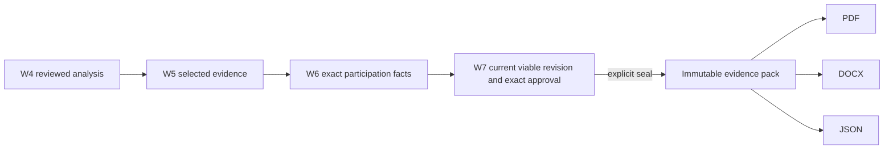

# W8 Proposal Evidence Pack

## Outcome

W8 adds an Organization-private Proposal workspace to each Pursuit. A user can explicitly seal one exact current `VIABLE` W7 scenario revision whose latest decision is `APPROVED_FOR_PROPOSAL`. The result is an immutable, price-free Proposal Evidence Pack with deterministic PDF, DOCX, and JSON exports.

W8 stops at proposal preparation. It does not submit, message candidates, certify compliance, rank teams, generate a price, or change an AI provider.

## Authority chain

The server reloads `get_proposal_handoff` while the authoritative W4 through W8 tables are locked for the sealing transaction. It checks active Membership, Organization and Pursuit ownership, exact scenario/revision/decision identities, current viability, and the current upstream chain. It re-runs the same handoff immediately before commit. Browser state is never an authority.

## Data model

- `PursuitProposalWorkspace`: one stable Organization and Pursuit destination.
- `ProposalEvidencePack`: sealed lineage, manifest hash, version, scenario, analysis, approval, and sealing Membership.
- `ProposalEvidencePackItem`: immutable ordered manifest item with authority type, upstream identity, provenance, source hash/version, review/evidence state, and scoped payload.
- `ProposalEvidenceArtifact`: immutable private export metadata and opaque storage key.

PostgreSQL constraints bind Organization, Pursuit, scenario revision, approval, workspace, pack item, and artifact relationships. Triggers reject updates/deletes of sealed packs, items, and artifacts and reject workspace deletion.

## API

- `GET /api/v1/pursuits/{pursuit_id}/proposal-workspace`
- `POST /api/v1/pursuits/{pursuit_id}/proposal-evidence-packs`
- `GET /api/v1/pursuits/{pursuit_id}/proposal-evidence-packs/{pack_id}`
- `POST /api/v1/pursuits/{pursuit_id}/proposal-evidence-packs/{pack_id}/exports`
- `GET /api/v1/pursuits/{pursuit_id}/proposal-evidence-artifacts/{artifact_id}/download`

All routes require approved platform access and Organization context. Seal, export, and download also validate an active Membership inside the domain service. Metadata reads are passive and use bounded, set-wise projections.

## Manifest truth

The manifest can contain Pursuit context, current Requirements and Positions, Gap outcomes, Lead Organization, Partner Firms, Experts, exact ProjectReferences, exact CVVersions, exact W6 facts, source/private document versions, company snapshot authority, later-stage obligations, and required forms.

Project reference `value_basis` is retained. `CONTRACT_TOTAL` and `CONSORTIUM_TOTAL` are never described as Firm share. Structured CV facts are labeled `STRUCTURED_CV_FACTS`; absent source CV bytes remain explicitly absent and the material is never labeled original or candidate-signed. A recorded `SIGNED_DOCUMENT` classification is retained as a claim while independent verification stays false because W7 does not seal the supporting document identity.

## Exports and staleness

Artifacts are rendered only from the sealed item snapshot. JSON uses a canonical encoding. PDF uses an invariant ReportLab canvas. DOCX normalizes ZIP ordering and timestamps. All record a hash, byte count, generator version, creator, and pack.

A pack remains historically valid. Current reads compare it with the current exact W7 handoff. Upstream W4, W5, W6, or W7 changes make `pack_current=false` with reasons. New ordinary exports are rejected for stale packs; an explicit historical export is labeled `HISTORICAL SNAPSHOT`. Existing artifacts remain downloadable after Membership revalidation.

## Compatibility and boundaries
I
Legacy `Proposal` rows, UUIDs, structured data, deep links, and commercial export routes remain separate. W8 performs no dual-write or migration. A SOURCE Pursuit may show a compatibility link to its legacy Proposal.

World Bank Project Context, Project Leadership, and procurement contacts remain unchanged. They do not become participants, Experts, CV evidence, contacts, or signatories without an existing explicit authority.

## Validation

Permanent W8 tests cover W7 to W8 upgrade/downgrade and drift, immutable/price-free model shape, exact SOURCE and UPLOAD flows, Firm and Expert evidence, source-CV absence, project value basis, participation provenance, company authority, required forms, later-stage obligations, all exports, staleness, historical labeling, tenant isolation, shared-candidate privacy, revoked Membership, legacy Proposal preservation, bounded passive reads, and World Bank fingerprints.

The Pursuit Proposal UI and browser fixture cover explicit confirmation, exact approved revision IDs, pack history, evidence presentation, and export actions.

Accepted release results on 2026-09-27:

- backend: 838 passed, 1 skipped, 100 subtests passed;
- frontend: 292/292 passed, with typecheck, lint, RTL audit, and production build passing;
- Chromium: 202/202 passed;
- security: 118 passed;
- analysis: 50 passed plus 12 subtests;
- connectors: 198 passed, 1 skipped, plus 6 subtests;
- migration heads/current/check/schema preflight: passed;
- dependency audits: Python clean and npm reported zero vulnerabilities;
- permanent release wrapper: passed.

See [the W8 audit directory](audits/w8/pack-sealing.md) for focused evidence and the stabilization handoff.
