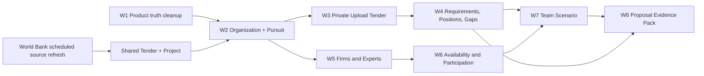

# W0 migration and risk map

## Engagement to pursuit decision

`TenderEngagement` has non-null user/profile/Tender foreign keys, a unique `(user_id, company_profile_id, tender_id)` constraint, seven status values, and origin values tied to explicit source Tender actions. `Proposal` and `TenderAnalysis` separately require Tender and user scope. The My Tenders API identifies Engagement UUIDs. These are structural constraints, not naming issues.

| Option | Migration and legacy compatibility | Source-linked and uploaded pursuit | Organization, documents, owner/deadline, analysis, team and proposal | Verdict |
|---|---|---|---|---|
| A. Extend Engagement into pursuit | Fewest initial tables, but changing non-null FKs, composite FK, unique key, owner semantics and all existing queries is a high-risk in-place migration. | Can support source link; uploaded origin needs nullable Tender plus alternative identity. | Current user/profile tuple conflicts with organization sharing; many new columns/relations overload status row. | Reject. |
| B. New OrganizationPursuit; backfill and wrap Engagement | Additive and restartable; preserve Engagement ID in mapping/compatibility layer, then retire writes. | Nullable source Tender supports both, with explicit source/upload origin. | New organization root owns private workspace and optional source link; Proposal and analysis attach by additive FKs. | **Recommend.** |
| C. Engagement subordinate to pursuit | Keeps old workflow but requires two status authorities and synchronization for every source-linked change. | Upload pursuits have no meaningful Engagement. | Proposal/analysis links still need pursuit; subordinate status can drift. | Reject as permanent design; temporary compatibility read only. |

Recommended invariant: one canonical lifecycle on OrganizationPursuit. Backfilled `legacy_engagement_id` is unique and stable. Legacy `/my-tenders` and `/tenders/{id}/engagement` resolve the mapped pursuit for the authenticated member. During cutover, new commands write only the pursuit; compatibility APIs adapt reads and commands, with a finite retirement date for Engagement writes. Never infer membership from email domain, company name, or tax text.

## Additive sequence (proposed, no migrations created)

1. Define organization and membership tables, explicit admin/user invitation/acceptance rules, active membership authorization helper, and one-to-one legacy profile mapping. Backfill exactly one organization and owner membership per existing user/profile in small restartable batches. Preserve platform approval/disable checks before membership checks.
2. Add OrganizationPursuit with organization FK, nullable source Tender FK, origin, owner membership/user, internal deadline, status, timestamps, and unique legacy Engagement FK. Backfill one row per Engagement using its exact profile owner; record exceptions, do not silently merge duplicate names. Add organization-scoped reads and parity checks.
3. Add private Document and immutable DocumentVersion with organization/pursuit ownership, classification, content hash, storage key, scan/parse state and retention. Keep `TenderDocument` source-only. Make upload-origin pursuit creation atomic with document intake state. Add explicit selection table for source document version in an analysis pack.
4. Add evidence record/version/assertion links. Backfill profile claims as `UNVERIFIED` unless bytes and provenance prove otherwise; retain old IDs. Preserve certification/license/financial history IDs in mapping before replacing full-collection PUT semantics.
5. Add pursuit-scoped analysis execution linkage and exact input document-version associations. Reuse AnalysisVersion immutable snapshot/hash conventions; keep historical TenderAnalysis/AnalysisVersion rows and quarantined legacy state. Add Requirement, Position, Gap and review identities without changing old results.
6. Add Proposal pursuit FK and artifact-version/evidence-pack links. Backfill via exact owner+Tender/Engagement mapping, flag ambiguous/orphan rows for review. Keep Proposal UUID links, then redirect Bid Preparation to pursuit Proposal tab. Remove active AI pricing in W1 before new proposal generation uses this path.
7. Add firm/expert/participation/scenario/task relations only after organization scope and private document authorization are enforced. Extend notification event contracts and source refresh attempt history. Keep public source facts outside private tables.
8. Cut over writes, compare row counts and authorization behavior, retire compatibility writes, then consider eventual deprecation of legacy tables. No destructive deletion is part of this sequence.

Every backfill needs a checkpoint, unique legacy key, idempotent upsert, count parity, quarantine report, and rollback via feature routing rather than destructive reversal. Dual-read is acceptable during verification; indefinite dual-write is not.

## Security and privacy gates

| Gate | Gap evidenced by current code | Required before gate passes |
|---|---|---|
| BLOCKER BEFORE PRIVATE UPLOAD | `TenderDocument` has no tenant FK; Proposal `/upload-tz` stores a local path and extracted text in mutable `structured_data`; `ReadinessDocument.optional_file_url` is not a managed file authority. | Separate private document/version schema, authenticated organization membership on every read/write/download/preview/parse/export, private storage namespace, no client-controlled path/URL authority, scoped worker inputs, malware/file validation, no private data in shared Tender or notifications. |
| BLOCKER BEFORE PRIVATE UPLOAD | Legacy `/upload-tz` writes a random UUID filename and `uploaded_tz_path`, while `/uploaded-tz` previews `{proposal.id}.pdf`; current previews can miss uploaded files. | New private preview resolves the authorized DocumentVersion storage key; W1 may fix the legacy read path separately without changing shared Tender behavior. |
| BLOCKER BEFORE PRIVATE UPLOAD | Analysis parent requires Tender and user/profile; versions snapshot extracted text and storage references. | Pursuit-scoped exact input versions, quarantine legacy rows, access checks for snapshots and derived text, signed download or streamed authorization with expiry and scope, delete/revocation behavior. |
| BLOCKER BEFORE EXTERNAL PILOT | No membership model; profile and Proposal are user owned; CVs, partner notes, candidates, and consent have no authorities. | Explicit membership roles and removal/revocation, tenant-scoped DB queries and worker tasks, consent and sharing controls, personal-data access audit, retention/deletion rules, tests for cross-tenant ID enumeration. |
| BLOCKER BEFORE EXTERNAL PILOT | Vault full replacement deletes/recreates child IDs; Proposal JSON is mutable; override IDs lack pursuit scope. | Stable evidence version IDs, non-destructive versioning, historical export binding, audited review/override actions. |
| POST-PILOT HARDENING | Current source refresh run has counters/lease but no full attempt/schedule ledger. | Attempt history, missed-schedule detection and stale-analysis notifications once baseline workflow is reliable. |

Current security foundation is useful: approval/disable/auth-version gates, user/profile ownership predicates, staged upload limits, path resolution, admin audit, release checks, and per-user notification delivery. These do not by themselves authorize organization-private assets.

## Vertical-slice order

W1 pricing cleanup and W2 tenant design can be prepared in parallel; W3 requires W2 authorization and private storage. W4 can start from source documents after W2 but must handle W3 upload versions for the full product. W5 can proceed alongside W3/W4 after W2. W6 depends on W5; W7 depends on W4 and W6; W8 depends on W4/W7 and safe Proposal compatibility. World Bank scheduled **source** refresh is a separate branch; current Beat only schedules Project enrichment backlog, not general source refresh. It may proceed after source scheduling/health design without writing private pursuit data.
